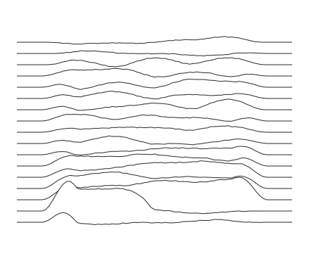

<div align="center">
<pre>
  _ _
 | | |_ ____ __  __ _ __ ___
 | |  _(_-&lt; '_ \/ _` / _/ -_)
 |_|\__/__/ .__/\__,_\__\___|
          |_|
</pre>
</div>

```console
ltspace@github:~$ whoami
Martha Kivelson — I build search: from a single disk to the open web

ltspace@github:~$ cat projects.toml
[dowse]
desc  = "Windows-native full-disk search: file names, doc contents, text in screenshots"
stack = ["rust", "tantivy", "tauri"]
repo  = "github.com/ltspace/dowse"

ltspace@github:~$ cat ~/work/projects.toml
cat: ~/work/projects.toml: Permission denied

ltspace@github:~$ sudo !!
[██████████]
desc  = "real-time search at scale — but the users are AI agents"
stack = ["go", "clickhouse", "kafka", "kubernetes", "mcp"]
repo  = "[redacted]"

ltspace@github:~$ grep -i interests ~/.profile
retrieval & ranking · distributed systems · local-first desktop tools

ltspace@github:~$ fetch --profile
repos      7 public · 3 original
stars      ★ 1
commits    176 in 2026
followers  6
langs      HTML     █████░░░░░  54.6%
           Rust     ███░░░░░░░  34.4%
           Svelte   ░░░░░░░░░░   4.3%
           CSS      ░░░░░░░░░░   3.1%

ltspace@github:~$ █
```

<div align="center">

<picture>
  <source media="(prefers-color-scheme: dark)" srcset="assets/pulse-dark.svg" />
  
</picture>

<sub>a year of commits · after <em>Unknown Pleasures</em></sub>

</div>
